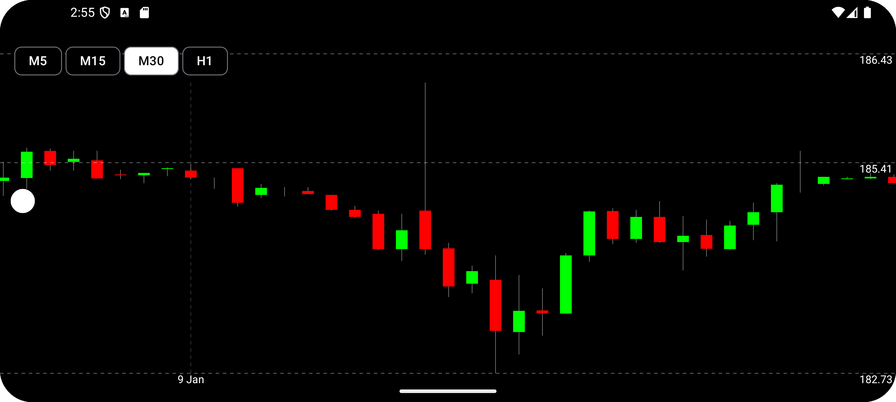

# 📈 Terminal Charts Pro

Приложение для анализа биржевых графиков с продвинутым управлением и обработкой ошибок.

## 🌟 Демонстрация

  
  

## 🚀 Ключевые особенности

### 📊 Визуализация данных
- Интерактивные свечные графики (OHLC)
- Поддержка 5+ таймфреймов
- Масштабирование жестами (pinch-to-zoom)
- Автомасштабирование по данным

### 🛡 Обработка ошибок
| Ошибка | Скриншот | Описание |
|--------|----------|----------|
| **Сеть** |  | Автоповтор при восстановлении связи |
| **Сервер** |  | Уведомление о проблемах API |

## ⚙️ Технический стек

### Ядро приложения
- **Kotlin** - Основной язык с корутинами и Flow
- **Jetpack Compose** - Современный UI-фреймворк
- **Material Design 3** - Система компонентов

### Архитектура
- **Clean Architecture** - Разделение на слои
- **MVVM** - Паттерн управления состоянием
- **Dagger Hilt** - Внедрение зависимостей

### Работа с данными
- **Retrofit + Gson** - Сетевые запросы
- **OkHttp** - HTTP-клиент с логированием
- **StateFlow** - Реактивное состояние UI

### Дополнительно
- **Custom Rate Limiter** - Ограничение 5 запросов/мин
- **Logging Interceptor** - Отладка API-запросов
