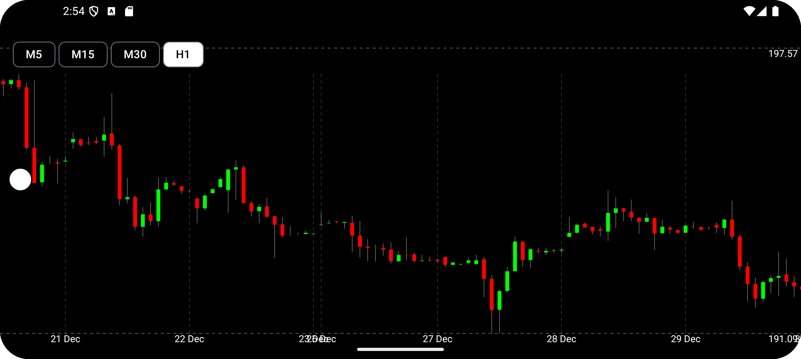

# Terminal App

Приложение для отображения биржевых графиков с поддержкой различных временных интервалов и обработкой ограничений API.

  
  

## Особенности

- 📊 Отображение свечных графиков акций
- ⏳ Поддержка различных временных интервалов
- 🌐 Обработка сетевых ошибок и ограничений API
- 🔄 Автоматическое обновление данных
- 🎨 Полностью реализовано на Jetpack Compose
- 🏗 Чистая архитектура (Clean Architecture) с UseCase и Repository

## Технологии

- **Язык**: Kotlin
- **UI**: Jetpack Compose
- **Архитектура**: MVVM
- **DI**: Hilt
- **Сеть**: Retrofit
- **Состояние**: Flow, StateFlow
